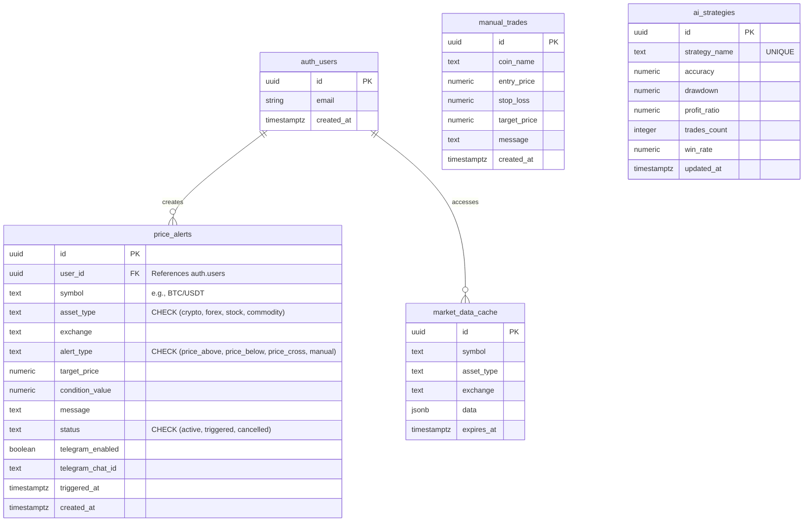
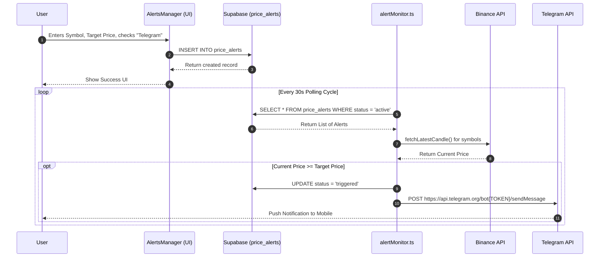
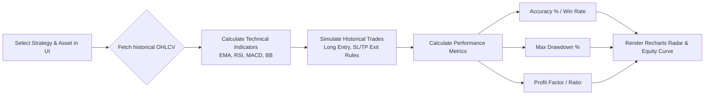

# CryptoAgent - Multi-Asset Algorithmic Trading Platform


**CryptoAgent** is a comprehensive, institutional-grade multi-asset algorithmic trading, paper simulation, and monitoring software. It allows users to track, analyze, and trade real-time market data across various asset classes (Cryptocurrencies, Forex, Stocks, and Commodities).

The application features a sophisticated Role-Based Access Control (RBAC) system, real-time push and Telegram notifications via a custom alert engine, a fully functional dynamic AI Strategy Builder & Backtester, a sandbox Paper Trading portfolio environment, and a centralized manual trading signal broadcast system.

---

## 📑 Table of Contents

- [Deep-Dive Features](#-deep-dive-features)
  - [User Capabilities](#user-capabilities)
  - [Administrator Capabilities](#administrator-capabilities)
- [Detailed Tech Stack](#-detailed-tech-stack)
- [System Architecture](#-system-architecture)
- [Database Schema & RLS](#-database-schema--rls)
- [Component Architecture & Flow](#-component-architecture--flow)
- [External API Integrations](#-external-api-integrations)
- [Setup & Configuration](#-setup--configuration)
- [Project Directory Structure](#-project-directory-structure)
- [Future Roadmap](#-future-roadmap)
- [License](#-license)

---

## 🚀 Deep-Dive Features

### User Capabilities
*   **Trading Feed & Dashboard**: View real-time market overviews, top gainers/losers, and trending assets globally.
*   **Interactive Trading Charts**: High-performance candlestick charts powered by `lightweight-charts`, integrated directly with a **live Binance WebSocket stream** (`wss://stream.binance.com:9443/ws/`) for sub-second crypto kline updates, falling back to REST APIs for traditional assets.
*   **Paper Trading Sandbox**: Practice trading with zero financial risk using a persistent $100,000 USD virtual portfolio. Features include placing BUY/SELL orders directly on the trading interface, an allocations pie chart, real-time unrealized P&L calculations, and a complete order logs history ledger.
*   **Personalized Settings**: Securely manage user profiles and configure Telegram Webhook IDs for external notifications.

### Administrator Capabilities
Administrators (identified by `crypto@crypto.com`) gain access to an exclusive suite of tools:
*   **AI Strategy Builder & Backtester**: A powerful, operational client-side backtesting engine. It fetches actual historical candlestick data from Binance, computes technical indicators (EMA, RSI, MACD, Bollinger Bands) in TypeScript, executes trade simulations, and displays real Win Rates, Drawdowns, Profit Ratios, and portfolio equity curves. Includes an "Optimize Hyperparameters" feature to simulate training neural networks for localized rule updates.
*   **Price Alerts Manager**: Set dynamic conditional alerts (`price_above`, `price_below`, `price_cross`). The background `alertMonitor.ts` continuously checks these parameters against live market data and dispatches instant Telegram messages when triggered.
*   **Manual Trade Broadcasting**: Directly dispatch manual trading signals (Entry, Target, Stop Loss) to the platform feed for all users to see, mimicking a VIP signal group.

---

## 🛠 Detailed Tech Stack

*   **Frontend Framework**: React 18 initialized via Vite for lightning-fast HMR and optimized production builds.
*   **Type Safety**: 100% strictly-typed TypeScript across components, hooks, and services.
*   **State & Data Fetching**: React Hooks (`useState`, `useEffect`) coupled with Supabase Realtime subscriptions and live WebSockets.
*   **Persistence**: Browser `localStorage` for secure, offline paper portfolio tracking.
*   **Styling Engine**: TailwindCSS for utility-first styling, paired with Lucide React for consistent, crisp SVG iconography.
*   **Data Visualization**: 
    *   `lightweight-charts` by TradingView for financial candlestick rendering.
    *   `recharts` for backtesting equity curves, strategy radar charts, and paper asset allocation pie charts.
*   **Backend & Auth**: Supabase (PostgreSQL). Handles user authentication (JWT), database interactions, and Row Level Security (RLS).

---

## 🏗 System Architecture

The platform architecture is designed for low latency and high availability. The frontend client establishes a direct WebSocket link to Binance streams for market charts, connects to Supabase for authentication and alert data, and utilizes a local persistence layer for the paper trading accounts.

```mermaid
graph TD
    classDef frontend fill:#3b82f6,stroke:#1d4ed8,stroke-width:2px,color:#fff
    classDef backend fill:#10b981,stroke:#047857,stroke-width:2px,color:#fff
    classDef external fill:#f59e0b,stroke:#b45309,stroke-width:2px,color:#fff

    subgraph "Frontend Client (React/Vite)"
        UI[User Interface & Routing]
        Charts[Lightweight Charts Engine]
        AlertWorker[Alert Polling Service]
        SimWorker[Market Simulator Service]
        PaperService[Paper Trading Service]
        Backtester[Backtesting & Indicators Engine]
        LocalDB[(Browser LocalStorage)]
    end

    subgraph "Supabase Backend Core"
        DB[(PostgreSQL Database)]
        Realtime[Realtime WebSocket Engine]
        Auth[GoTrue Auth Service]
    end

    subgraph "External Ecosystem"
        BinanceWS[Binance WebSocket Stream]
        BinanceREST[Binance REST API]
        CoinGecko[CoinGecko API]
        Telegram[Telegram Bot API]
    end

    UI <--> |JWT Authentication| Auth
    UI <--> |CRUD Operations| DB
    UI <--> |Live Subscriptions| Realtime
    PaperService <--> |Persist Portfolio| LocalDB
    UI <--> PaperService
    UI <--> Backtester
    
    Charts <--> |Stream Sub-second Price| BinanceWS
    Charts -.-> |Fetch Historical Candles| BinanceREST
    Backtester --> |Load Historical Data| BinanceREST
    SimWorker --> |Fetch Global Market Data| CoinGecko
    
    AlertWorker --> |Poll Active Alerts| DB
    AlertWorker --> |Trigger Condition Met| Telegram
    AlertWorker --> |Fetch Latest Price| BinanceREST

    class UI,Charts,AlertWorker,SimWorker,PaperService,Backtester,LocalDB frontend;
    class DB,Realtime,Auth backend;
    class BinanceWS,BinanceREST,CoinGecko,Telegram external;
```



---

## 🗄 Database Schema & RLS

The PostgreSQL database leverages Supabase Row Level Security (RLS) to ensure users can only access and mutate their own data, while Admins have broader privileges.



### Security Policies (Row Level Security)
- **`price_alerts`**: Users can `SELECT`, `INSERT`, `UPDATE`, and `DELETE` only where `auth.uid() = user_id`.
- **`manual_trades`**: Public read access (`anon`), but only authorized administrators should be inserting via the UI.
- **`ai_strategies`**: Public read access to display backtest metrics globally.

---

## 🔄 Component Architecture & Flow

### Alert Trigger Lifecycle
This sequence diagram illustrates the lifecycle of a price alert, from user creation to the background service triggering a Telegram push notification.



### AI Strategy Backtesting & Indicators Flow


---

## 🌐 External API Integrations

1. **Binance WebSocket Stream** (`wss://stream.binance.com:9443`)
   - Used for sub-second, low-latency candlestick updates (`/ws/<symbol>@kline_1m`) on the charting view.
2. **Binance REST API** (`api.binance.com`)
   - Used for fetching historical candlestick data (`/api/v3/klines`) and real-time ticker prices (`/api/v3/ticker/price`) during backtests and manual trade assessments.
3. **CoinGecko API** (`api.coingecko.com`)
   - Used within `marketSimulation.ts` to fetch 24-hour global volume, price changes, and metadata for a predefined list of top cryptocurrencies.
4. **Telegram Bot API** (`api.telegram.org`)
   - Used in `telegramService.ts` to push JSON payloads containing triggered alert details to specific `chat_id`s.

---

## ⚙️ Setup & Configuration

### Prerequisites
- Node.js (v18+)
- npm or yarn
- Supabase Account
- Telegram Bot Token (obtained from `@BotFather`)

### 1. Clone the Repository
```bash
git clone https://github.com/yourusername/multi-asset-algorithmic-trading-software.git
cd multi-asset-algorithmic-trading-software
```

### 2. Install Dependencies
```bash
npm install
```

### 3. Environment Configuration
Create a `.env` file in the root directory:

```env
VITE_SUPABASE_URL=https://your-project.supabase.co
VITE_SUPABASE_ANON_KEY=your_supabase_anon_key
VITE_TELEGRAM_BOT_TOKEN=your_telegram_bot_token
```

### 4. Database Migrations
Navigate to the Supabase SQL Editor in your dashboard and execute the SQL files in the following order:
1. `create_price_alerts_table.sql`
2. `supabase/migrations/20251027051145_create_crypto_trading_tables.sql`
3. `fix_rls_issues.sql`

### 5. Start Development Server
```bash
npm run dev
```
The application will launch on `http://localhost:5173`. 
*Note: To access admin features, create an account with the email `crypto@crypto.com`.*

---

## 📁 Project Directory Structure

```text
multi-asset-algorithmic-trading-software/
├── src/
│   ├── components/                 # React UI Views
│   │   ├── Auth/                   # Login/Signup Forms
│   │   ├── AIStrategyBuilder.tsx   # Recharts backtesting UI
│   │   ├── AlertsManager.tsx       # Alert creation & list
│   │   ├── Dashboard.tsx           # Main analytics view
│   │   ├── ManualTrades.tsx        # Admin signal broadcasting
│   │   ├── MarketDashboard.tsx     # Trading terminal & paper order widget
│   │   ├── PaperTrading.tsx        # Paper trading portfolio UI
│   │   ├── StrategyAlerts.tsx      # System alert feed
│   │   ├── TradingViewChart.tsx    # Live WebSocket lightweight-charts wrapper
│   │   └── UserDashboard.tsx       # Standard user feed
│   ├── lib/
│   │   └── supabase.ts             # Supabase client instantiation
│   ├── services/                   # Business Logic & APIs
│   │   ├── alertMonitor.ts         # Background alert polling
│   │   ├── dataFeed.ts             # Binance/External data fetchers
│   │   ├── marketSimulation.ts     # CoinGecko volume simulator
│   │   ├── paperTradingService.ts  # Virtual trade ledger & balance store
│   │   └── telegramService.ts      # Push notification dispatcher
│   ├── utils/                      # Mocks and helpers
│   ├── App.tsx                     # Routing & RBAC Gatekeeper
│   ├── main.tsx                    # React DOM entry
│   └── index.css                   # Tailwind base imports
├── supabase/
│   └── migrations/                 # DB schemas and initial seed data
├── .env                            # Local environment variables
├── package.json                    # Dependencies & Scripts
├── tailwind.config.js              # Theme customization
├── vite.config.ts                  # Bundler configuration
└── README.md                       # Documentation
```

---

## 🔮 Future Roadmap

- **Self-Learning AI Integration**: Implementing reinforcement learning for real-time strategy optimization.
- **Automated Hyperparameter Tuning**: Neural architecture search for indicator optimization.
- **Sentiment Analysis**: Ingesting Twitter/X and News APIs to gauge market fear/greed indices.
- **Broker Integration**: Execution of trades directly via CCXT (Crypto) and MetaTrader API (Forex).

---

## 📄 License
This project is licensed under the MIT License - see the LICENSE file for details.
