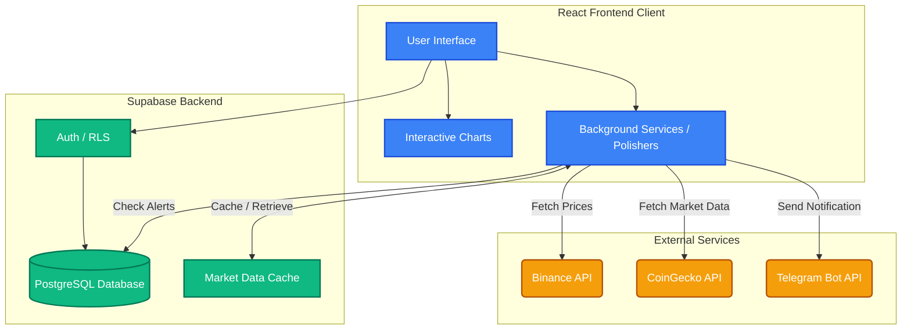
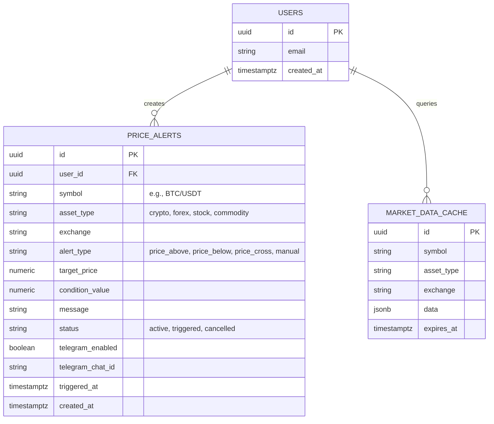
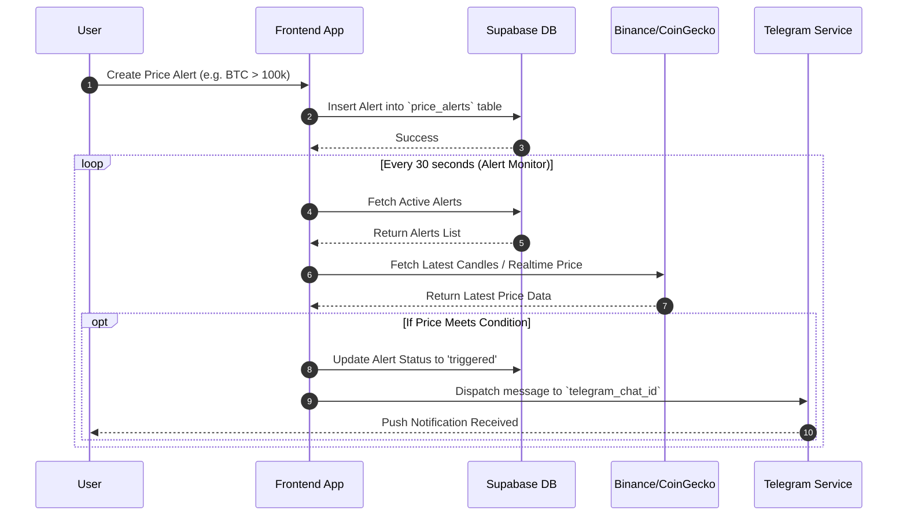

# CryptoAgent - Multi-Asset Algorithmic Trading Platform


**CryptoAgent** is a comprehensive multi-asset algorithmic trading software designed to track, analyze, and manage real-time market data across various asset classes, including Cryptocurrencies, Forex, Stocks, and Commodities. Built with React and Supabase, it provides role-based access, automated alerting systems, and an AI strategy builder.

---

## 📑 Table of Contents

- [Key Features](#-key-features)
- [Tech Stack](#-tech-stack)
- [System Architecture](#-system-architecture)
- [Database Schema](#-database-schema)
- [Application Flow](#-application-flow)
- [Setup & Installation](#-setup--installation)
- [Project Structure](#-project-structure)
- [License](#-license)

---

## 🚀 Key Features

*   **Multi-Asset Support**: Track and trade Cryptocurrencies, Forex, Stocks, and Commodities from a single interface.
*   **Real-time Market Data Feeds**: Integration with Binance and CoinGecko for up-to-the-minute price and volume data.
*   **Role-Based Access Control (RBAC)**: Distinct views and capabilities for regular users (trading feed) and administrators (AI Strategy Builder, Manual Trades, and Alerts Manager).
*   **Advanced Price Alerts**: Set dynamic conditional alerts (`price_above`, `price_below`, `price_cross`) with real-time push and Telegram notifications.
*   **Interactive Trading Charts**: High-performance, interactive candlestick charts using Lightweight Charts and Recharts.
*   **AI Strategy Builder**: Define custom algorithmic trading strategies using multiple technical indicators (EMA, RSI, MACD).

---

## 🛠 Tech Stack

*   **Frontend**: React 18, Vite, TypeScript
*   **Styling**: TailwindCSS, Lucide React (Icons)
*   **Charting**: Lightweight Charts (TradingView), Recharts
*   **Backend / Database**: Supabase (PostgreSQL, Row Level Security)
*   **APIs**: Binance API, CoinGecko API, Telegram Bot API

---

## 🏗 System Architecture

The application adopts a modern serverless backend architecture connected to a reactive frontend.



---

## 🗄 Database Schema

The core backend relies on a PostgreSQL database managed by Supabase. Here is the Entity-Relationship (ER) diagram for the main operational tables.



---

## 🔄 Application Flow

The system continuously monitors market data and checks active user alerts. When a condition is met, notifications are dispatched.



---

## ⚙️ Setup & Installation

### Prerequisites
- Node.js (v18 or higher)
- npm or yarn
- Supabase Account and Project
- (Optional) Telegram Bot Token

### 1. Clone the repository
```bash
git clone https://github.com/yourusername/multi-asset-algorithmic-trading-software.git
cd multi-asset-algorithmic-trading-software
```

### 2. Install Dependencies
```bash
npm install
```

### 3. Environment Variables
Create a `.env` file in the root directory and add your Supabase credentials:

```env
VITE_SUPABASE_URL=your_supabase_project_url
VITE_SUPABASE_ANON_KEY=your_supabase_anon_key
```

### 4. Database Setup
Execute the SQL migrations found in the `supabase/migrations/` and the root `.sql` files directly in your Supabase SQL Editor to set up the necessary tables (e.g., `price_alerts`) and Row Level Security (RLS) policies.
- Run `create_price_alerts_table.sql`
- Run `fix_rls_issues.sql`

### 5. Start the Development Server
```bash
npm run dev
```
The application will be running at `http://localhost:5173`.

---

## 📁 Project Structure

```text
multi-asset-algorithmic-trading-software/
├── src/
│   ├── components/       # Reusable React components & Views
│   │   ├── Auth/         # Login & Signup flows
│   │   ├── AIStrategyBuilder.tsx
│   │   ├── AlertsManager.tsx
│   │   ├── TradingViewChart.tsx
│   │   └── ...
│   ├── lib/              # Library configurations (e.g., Supabase client)
│   ├── services/         # Core business logic
│   │   ├── alertMonitor.ts       # Polling and processing alerts
│   │   ├── dataFeed.ts           # Interacting with Binance/CoinGecko APIs
│   │   ├── marketSimulation.ts   # Market simulation utilities
│   │   └── telegramService.ts    # Telegram bot integration
│   ├── utils/            # Helper functions
│   ├── App.tsx           # Main application routing and RBAC handling
│   ├── index.css         # Tailwind directives
│   └── main.tsx          # Application entry point
├── supabase/
│   └── migrations/       # Database migration scripts
├── package.json          # Project dependencies and scripts
├── tailwind.config.js    # Tailwind configuration
├── vite.config.ts        # Vite configuration
└── README.md             # This documentation
```

---

## 📄 License
This project is licensed under the MIT License.
