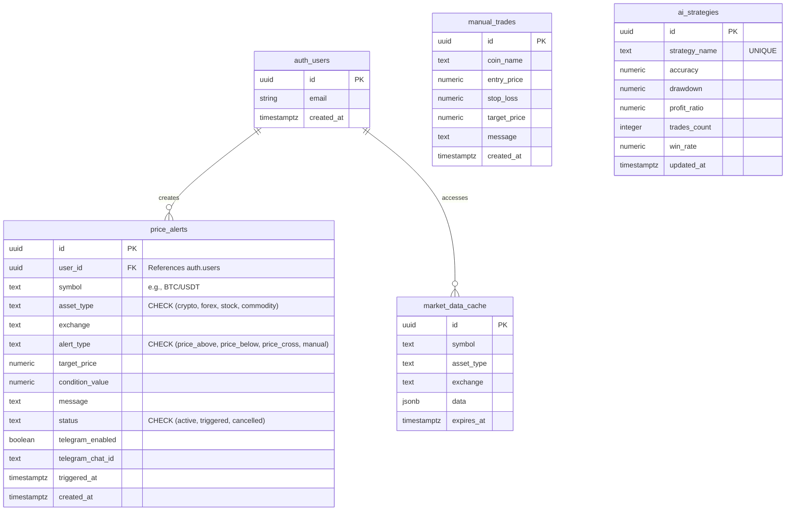

# CryptoAgent - Multi-Asset Algorithmic Trading Platform


**CryptoAgent** is a comprehensive, institutional-grade multi-asset algorithmic trading, paper simulation, and risk analysis platform. It allows quantitative traders to backtest indicator-based models, simulate portfolio exposures under extreme drawdowns, track live digital assets via sub-second WebSocket feeds, and dispatch real-time status notifications to Telegram.

---

## 📑 Table of Contents

1. [Deep-Dive Features](#-deep-dive-features)
   - [User Workspace Capabilities](#user-workspace-capabilities)
   - [Administrator Workspace Capabilities](#administrator-workspace-capabilities)
2. [Coinbase-Inspired Design System](#-coinbase-inspired-design-system)
   - [Visual Tokens & Color Palette](#visual-tokens--color-palette)
   - [Typography & Geometry Rules](#typography--geometry-rules)
3. [Core Algorithms & Mathematical Frameworks](#-core-algorithms--mathematical-frameworks)
   - [Geometric Brownian Motion (Monte Carlo)](#1-geometric-brownian-motion-monte-carlo)
   - [Risk of Ruin Computation](#2-risk-of-ruin-computation)
   - [Sharpe and Sortino Risk-Adjusted Ratios](#3-sharpe-and-sortino-risk-adjusted-ratios)
   - [Parametric Value at Risk (VaR)](#4-parametric-value-at-risk-var)
   - [Pearson Correlation Matrix](#5-pearson-correlation-matrix)
4. [System Architecture](#-system-architecture)
5. [Database Schema & RLS Security](#-database-schema--rls-security)
6. [External API Integrations](#-external-api-integrations)
7. [Developer Setup & Configuration](#-developer-setup--configuration)
8. [Directory Layout](#-directory-layout)

---

## 🚀 Deep-Dive Features

### User Workspace Capabilities

*   **CryptoAgent Landing Page**: A premium, full-width showcase introducing users to the terminal features. Features include:
    *   **Live Market Rates Bar**: A light-gray elevation band mapping real-time pricing indicators.
    *   **Portfolio Snapshot Previews**: Multi-layered product mockup cards displaying cash value growth, 24h performance ratios, and active risk stats.
    *   **Interactive Anchors**: Direct links to explorer listings, backtest specs, and the main workspace entrance.
*   **Trading Feed & Dashboard**: A real-time, central activity feed showing active AI strategies, triggered price alerts, and manual admin trading broadcasts (Entry, Target, Stop Loss).
*   **Interactive Trading Charts**: High-performance charting powered by TradingView's `lightweight-charts`. 
    *   **Crypto Feeds**: Direct connection to the **live Binance WebSocket stream** (`wss://stream.binance.com:9443/ws/`) for sub-second, sub-150ms kline updates.
    *   **Traditional Assets**: REST-based polling fallbacks for global indexes, commodities, and Forex rates.
*   **Paper Trading Sandbox**: A risk-free, client-side trading workspace.
    *   **Balance Ledger**: Persistent virtual portfolio initialized at $100,000 USD.
    *   **Order Book Execution**: Execute market buy/sell trades with instant slippage estimates, active position tracking, and manual liquidation controls.
    *   **Asset Allocation Charting**: A Recharts pie representation rendering current cash vs. holdings ratios.
    *   **HWM & Drawdown Visualizer**: A Composed Recharts chart displaying portfolio equity, tracking peak valuations (High-Water Mark), and dynamically shading the area under it during drawdown states.
    *   **Stochastic Ruin Predictor**: Computes 1,000+ geometric Brownian motion paths to calculate the probability of strategy bankruptcy.
    *   **Institutional Statistics Matrix**: Calculates and displays risk-adjusted metrics (Sharpe, Sortino, VaR, Correlations) in real-time.
*   **Personalized Configurations**: Set user names, save interface rules, and save Telegram Chat IDs to enable background notification routing.

### Administrator Workspace Capabilities

Administrators (automatically logged in under the credentials `crypto@crypto.com`) access additional tooling:
*   **AI Strategy Builder & Backtester**: A client-side backtesting engine.
    *   **Historical Candle Loader**: Fetches actual historical OHLCV klines from Binance REST endpoints.
    *   **Technical Indicator Pipeline**: Computes indicators (EMA, RSI, MACD, Bollinger Bands) in native TypeScript.
    *   **Backtest Simulator**: Executes logic rules to calculate Win Rates, Profit Factors, maximum drawdowns, and renders an equity curve overlay.
    *   **Hyperparameter Optimizer**: Runs iterative loops over variable indicator ranges to automatically identify maximum profitability levels.
*   **Price Alerts Manager**: Set conditional alerts (`price_above`, `price_below`, `price_cross`). The background alert polling thread (`alertMonitor.ts`) validates these parameters against live REST tickers, updating state tables and executing API triggers.
*   **Manual Signal Broadcast**: Set custom entry points, profit targets, and stop-loss levels, then publish them directly to the main user feed.

---

## 🎨 Coinbase-Inspired Design System

The frontend layout strictly inherits the quietly-confident Coinbase brand voice defined in `DESIGN.md`.

### Visual Tokens & Color Palette

| Token | Hex / Value | Application |
|---|---|---|
| **Canvas** | `#ffffff` | Primary bright background page floor |
| **Surface Soft** | `#f7f7f7` | Soft gray elevation bands, list backgrounds, main container floor |
| **Surface Dark** | `#0a0b0d` | Deep near-black background for landing page heroes, pre-footers, and headers |
| **Surface Dark Elevated** | `#16181c` | One step lighter, used for mockup cards, sidebar admin panels |
| **Primary (Coinbase Blue)** | `#0052ff` | Used scarcely. The single brand voltage for active buttons, key links, and icons |
| **Primary Active** | `#003ecc` | Pressed/Hover state darken for blue buttons |
| **Hairline** | `#dee1e6` | Subtle 1px dividers on white canvases |
| **Hairline Soft** | `#eef0f3` | Subtle 1px dividers on gray surfaces |
| **Semantic Up** | `#05b169` | Text-only coloring for positive asset gains and returns |
| **Semantic Down** | `#cf202f` | Text-only coloring for negative asset losses and drawdowns |

### Typography & Geometry Rules

1. **Display Weights**: Headlines use `Inter` at weight 400 (never bold 700+), mapping to the quiet editorial style. Negative tracking (`tracking-tight` at -1.5% to -2%) is applied to displays only.
2. **Numeric Rendering**: Every numerical value (prices, balance sums, percentages, stats matrix) is rendered in the monospace font `JetBrains Mono`.
3. **Pill & Shape Geometries**:
   - Interactive buttons, search bars, and tags use `{rounded.pill}` (100px / `rounded-full`).
   - Cards, chart containers, and modular panels use `{rounded.xl}` (24px / `rounded-3xl`).
   - Avatars and asset icons use circular geometry (diameter 32px / `rounded-full`).
4. **Mobile Responsive Strategy**:
   - Navigation collapses to an overlay drawer sliding out from the left.
   - Display headlines step down dynamically (80px → 64px → 40px).
   - Stacking layouts collapse from 3-up to 1-up grids.
   - Overlapping card mockups collapse to a single card to fit small screens.

---

## 🧮 Core Algorithms & Mathematical Frameworks

### 1. Geometric Brownian Motion (Monte Carlo)

To simulate future price paths, we assume prices follow a stochastic process under Geometric Brownian Motion (GBM):
$$dS_t = \mu S_t dt + \sigma S_t dW_t$$

We discretize this process over the daily step horizon $\Delta t = 1$:
$$S_t = S_{t-1} \exp\left(\left(\mu - \frac{1}{2}\sigma^2\right)\Delta t + \sigma Z \sqrt{\Delta t}\right)$$

Where:
*   $S_t$: Simulated portfolio value on day $t$.
*   $\mu$: Daily return drift coefficient, calculated from historical performance:
    $$\mu = \text{mean}(R)$$
*   $\sigma$: Daily standard deviation of historical portfolio returns:
    $$\sigma = \sqrt{\frac{1}{N-1}\sum_{i=1}^{N}(R_i - \bar{R})^2}$$
*   $Z$: Random variable generated using the **Box-Muller Transform** to map uniform coordinates to a standard normal distribution:
    $$Z = \sqrt{-2\ln U_1} \cos(2\pi U_2) \quad \text{where } U_1, U_2 \sim \text{Uniform}(0,1)$$

### 2. Risk of Ruin Computation

The risk of ruin predicts the probability that the portfolio value will hit or fall below a specified drawdown liquidation threshold (e.g., $75,000) at any point during the $N$-day horizon (simulated over $M = 1000$ paths):
$$\text{Risk of Ruin} = \frac{1}{M}\sum_{m=1}^{M} \mathbb{I}\left( \min_{0 \le t \le N} S_{t,m} < \text{Threshold} \right) \times 100\%$$

Where $\mathbb{I}$ is the indicator function, returning $1$ if the condition is met and $0$ otherwise.

### 3. Sharpe and Sortino Risk-Adjusted Ratios

*   **Sharpe Ratio**: Measures the portfolio return relative to total volatility:
    $$\text{Sharpe} = \frac{R_p - R_f}{\sigma_p} \times \sqrt{252}$$
    Where $R_p$ is average daily return, $R_f$ is risk-free rate, and $\sigma_p$ is standard deviation.
*   **Sortino Ratio**: Focuses on downside risk by replacing total volatility with downside deviation ($\sigma_d$):
    $$\text{Sortino} = \frac{R_p - R_f}{\sigma_d} \times \sqrt{252}$$
    $$\text{where } \sigma_d = \sqrt{\frac{1}{N} \sum_{i=1}^{N} \left[\min\left(0, R_{i} - R_f\right)\right]^2}$$

### 4. Parametric Value at Risk (VaR)

Represents the maximum expected dollar loss over a 1-day horizon at a given confidence level ($1-\alpha$):
$$\text{VaR}_{1-\alpha} = \text{Portfolio Value} \times \left( Z_{\alpha} \times \sigma_p \right)$$
Where $Z_{\alpha}$ is the normal distribution critical value ($1.645$ for $95\%$ confidence, $2.326$ for $99\%$ confidence).

### 5. Pearson Correlation Matrix

Correlates simulated portfolio returns against global asset classes (Bitcoin, S&P 500, Gold, EUR/USD):
$$\rho_{X,Y} = \frac{\sum_{i=1}^{N}(X_i - \bar{X})(Y_i - \bar{Y})}{\sqrt{\sum_{i=1}^{N}(X_i - \bar{X})^2 \sum_{i=1}^{N}(Y_i - \bar{Y})^2}}$$

---

## 🏗 System Architecture

The platform architecture is designed for low latency. A client-side WebSockets interface streams real-time data from Binance, while Supabase handles configurations and alerts.

```mermaid
graph TD
    classDef frontend fill:#0052ff,stroke:#003ecc,stroke-width:2px,color:#fff
    classDef backend fill:#10b981,stroke:#047857,stroke-width:2px,color:#fff
    classDef external fill:#f59e0b,stroke:#b45309,stroke-width:2px,color:#fff

    subgraph "Frontend Client (React/Vite)"
        UI[User Interface & Routing]
        Charts[Lightweight Charts Engine]
        AlertWorker[Alert Polling Service]
        SimWorker[Market Simulator Service]
        PaperService[Paper Trading Service]
        Backtester[Backtesting & Indicators Engine]
        LocalDB[(Browser LocalStorage)]
    end

    subgraph "Supabase Backend Core"
        DB[(PostgreSQL Database)]
        Realtime[Realtime WebSocket Engine]
        Auth[GoTrue Auth Service]
    end

    subgraph "External Ecosystem"
        BinanceWS[Binance WebSocket Stream]
        BinanceREST[Binance REST API]
        CoinGecko[CoinGecko API]
        Telegram[Telegram Bot API]
    end

    UI <--> |JWT Authentication| Auth
    UI <--> |CRUD Operations| DB
    UI <--> |Live Subscriptions| Realtime
    PaperService <--> |Persist Portfolio| LocalDB
    UI <--> PaperService
    UI <--> Backtester
    
    Charts <--> |Stream Sub-second Price| BinanceWS
    Charts -.-> |Fetch Historical Candles| BinanceREST
    Backtester --> |Load Historical Data| BinanceREST
    SimWorker --> |Fetch Global Market Data| CoinGecko
    
    AlertWorker --> |Poll Active Alerts| DB
    AlertWorker --> |Trigger Condition Met| Telegram
    AlertWorker --> |Fetch Latest Price| BinanceREST

    class UI,Charts,AlertWorker,SimWorker,PaperService,Backtester,LocalDB frontend;
    class DB,Realtime,Auth backend;
    class BinanceWS,BinanceREST,CoinGecko,Telegram external;
```



---

## 🗄 Database Schema & RLS Security

The database runs PostgreSQL with Supabase Row Level Security (RLS) policies enabled.



### Row Level Security (RLS) Policy Implementations

1. **Price Alerts Ownership**:
   ```sql
   ALTER TABLE price_alerts ENABLE ROW LEVEL SECURITY;

   CREATE POLICY "Users can manage their own alerts" ON price_alerts
     FOR ALL TO authenticated
     USING (auth.uid() = user_id)
     WITH CHECK (auth.uid() = user_id);
   ```

2. **Signals & Backtests Global Read**:
   ```sql
   ALTER TABLE manual_trades ENABLE ROW LEVEL SECURITY;

   CREATE POLICY "Anyone can view published signals" ON manual_trades
     FOR SELECT TO anon, authenticated
     USING (true);
   ```

---

## 🌐 External API Integrations

1. **Binance WebSocket Stream** (`wss://stream.binance.com:9443`)
   - `/ws/<symbol>@kline_1m`: Feeds sub-second candlestick values to charts.
2. **Binance REST API** (`api.binance.com`)
   - `/api/v3/klines`: Fetches historical OHLCV data for backtesting.
   - `/api/v3/ticker/price`: Fetches current ticker prices.
3. **CoinGecko API** (`api.coingecko.com`)
   - `/api/v3/coins/markets`: Fetches global market caps, 24h volumes, and gainers.
4. **Telegram Bot API** (`api.telegram.org`)
   - `/bot<token>/sendMessage`: Dispatches real-time alerts to Telegram.

---

## ⚙️ Setup & Configuration

### Prerequisites
- Node.js (v18+)
- Supabase project
- Telegram bot token (from `@BotFather`)

### 1. Installation
```bash
git clone https://github.com/yourusername/multi-asset-algorithmic-trading-software.git
cd multi-asset-algorithmic-trading-software
npm install
```

### 2. Configure Environment Variables
Create a `.env` file in the root directory:
```env
VITE_SUPABASE_URL=https://your-project.supabase.co
VITE_SUPABASE_ANON_KEY=your_supabase_anon_key
VITE_TELEGRAM_BOT_TOKEN=your_telegram_bot_token
```

### 3. Deploy Database Schemes
Execute the following SQL migration scripts in your Supabase SQL Editor:
1. `create_price_alerts_table.sql`
2. `supabase/migrations/20251027051145_create_crypto_trading_tables.sql`
3. `fix_rls_issues.sql`

### 4. Launch Development Server
```bash
npm run dev
```
The workspace will load at `http://localhost:5173`. Sign in as `crypto@crypto.com` to access administrator capabilities.

---

## 📁 Directory Layout

```text
multi-asset-algorithmic-trading-software/
├── src/
│   ├── components/                 # React UI Views
│   │   ├── LandingPage.tsx         # Responsive landing page (Coinbase Display style)
│   │   ├── MarketDashboard.tsx     # Trading terminal & chart
│   │   ├── PaperTrading.tsx        # Portfolio simulator & ledger
│   │   ├── Dashboard.tsx           # Global statistics & visualizer
│   │   ├── AlertsManager.tsx       # Set active alerts
│   │   ├── AIStrategyBuilder.tsx   # Strategy backtester & optimizer
│   │   └── UserDashboard.tsx       # Live feed workspace
│   ├── services/                   # APIs & Workers
│   │   ├── alertMonitor.ts         # Polling worker for active alerts
│   │   ├── telegramService.ts      # Sends alert messages
│   │   ├── paperTradingService.ts  # Virtual ledger & balance tracker
│   │   └── dataFeed.ts             # Binance WebSocket & REST services
│   ├── utils/                      # Calculations
│   │   └── riskCalculators.ts      # Sharpe, Sortino, VaR, & Monte Carlo pathing
│   ├── App.tsx                     # Routing & Sidebar Navigation Drawer
│   ├── index.css                   # Global styles & font overrides
│   └── main.tsx                    # React DOM bootstrapper
├── tailwind.config.js              # Coinbase branding configuration
├── tsconfig.json                   # TypeScript configuration
└── README.md                       # Documentation
```
